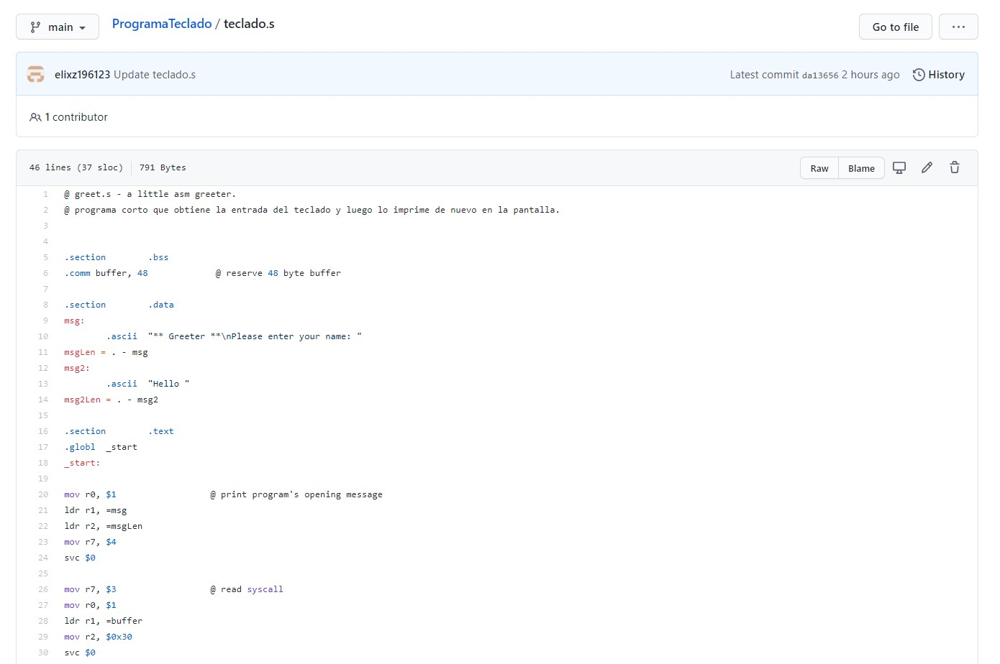
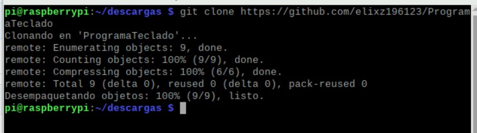
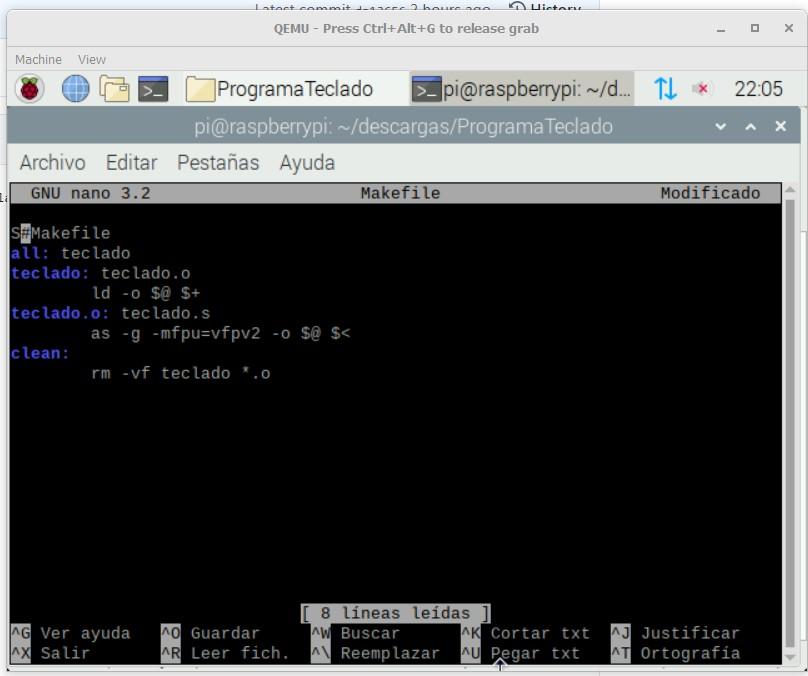
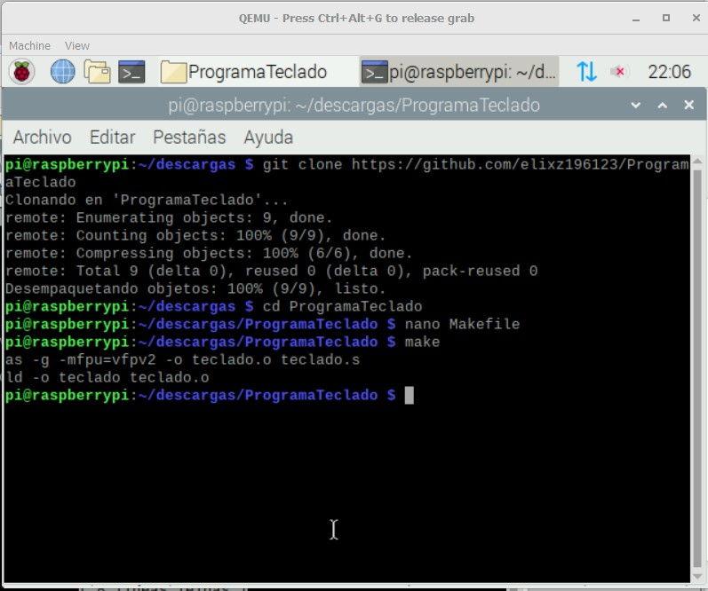
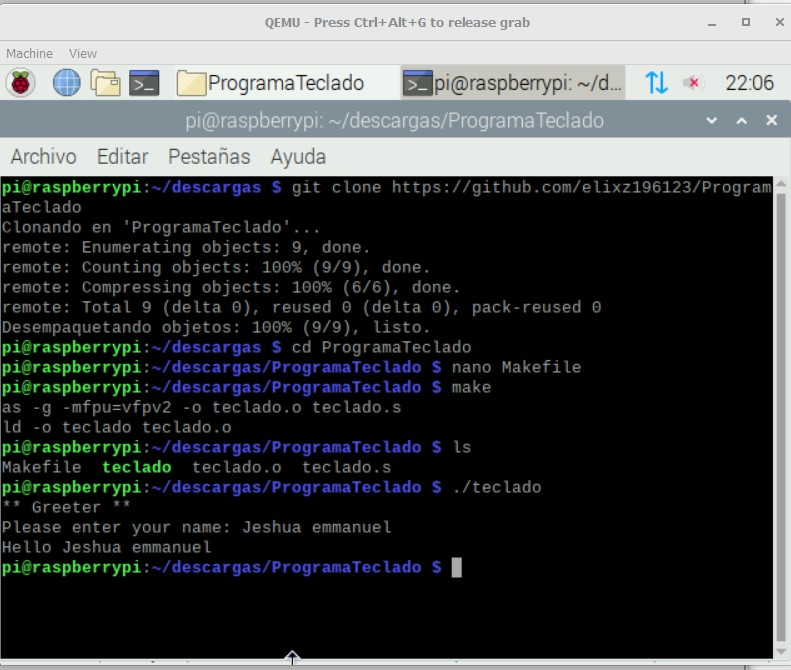

# 3.1.-B3.1-Usando-MAKE-de-GNU-para-automatizar-la-Terminal.

### Clonamos el repositorio con el siguiente codigo a nuestro quemu

## Codigo:
https://github.com/tectijuana/interfaz/edit/master/arm32/codigo/teclado.s

### Despues en el directorio que clonamos creamos el archivo make file con el codigo que se muestra

### luego ejecutamos el archivo make

### por ultimo corremos el archivo "teclado"

